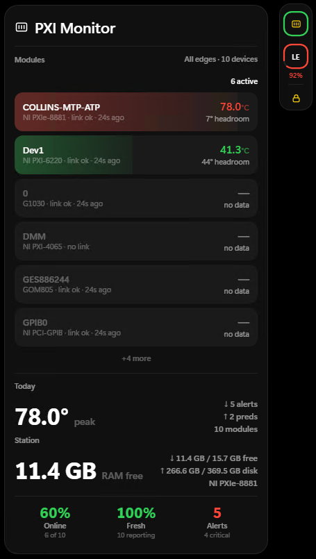
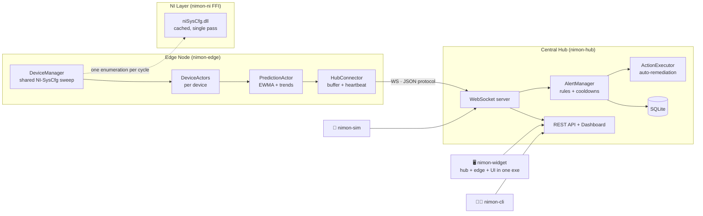

<div align="center">

# ◈ NIMon

**Real-time monitoring, prediction, and self-healing for National Instruments test stations.**

Rust · Actix · Tokio · Tauri · SQLite

[](https://github.com/zeshanabdullah10/nimon/releases)
[](LICENSE)
[](https://www.rust-lang.org)
[](#prerequisites)



*Edge nodes discover NI hardware via NI-SysCfg, stream telemetry to a central hub,
and a right-docked widget keeps the whole rack visible at a glance.*

</div>

---

## Why NIMon

Test stations run PXI chassis, CompactDAQ, and C-series modules that fail
silently — a module overheats, a chassis drops off the bus, a disk fills up —
until the test itself fails and costs hours. NIMon watches the hardware layer
continuously and tells you *before* it matters:

- **Native NI integration** — discovers real and NI MAX-simulated devices through
  NI-SysCfg with zero configuration: NI MAX names (`cDAQ_9205_AI`), slot numbers,
  per-sensor temperatures with critical thresholds, chassis topology, and station
  resources (RAM/disk/OS)
- **Prediction engine** — EWMA anomaly detection and trend analysis on the edge,
  flagging `Overheating` and `ConnectionFailure` predictions with ETA *before* thresholds trip
- **Self-healing** — rule-driven auto-remediation actions on critical alerts
- **Multi-channel alerting** — console, Slack, Teams, generic webhooks, and email (SMTP), with per-rule routing and cooldowns
- **Three interfaces, one hub** — a slim always-on-top Windows widget, a Material 3 web dashboard, and a CLI
- **Built for constrained machines** — measured at **~2.3% of one core** in steady state, `BELOW_NORMAL` priority, capped thread pools: a passive add-on that never competes with your test software
- **Graceful degradation everywhere** — no NI drivers? Simulated fallback. Hub already running? The widget attaches as a viewer

## Architecture



| Crate | Role |
|-------|------|
| [`nimon-core`](crates/nimon-core) | Shared types, protocol, actor messages, DB repositories |
| [`nimon-ni`](crates/nimon-ni) | FFI to NI-SysCfg (property-complete: aliases, slots, sensors, system info) |
| [`nimon-edge`](crates/nimon-edge) | Device discovery, health sweeps, prediction, hub streaming |
| [`nimon-hub`](crates/nimon-hub) | WebSocket aggregation, REST API, web dashboard, alerts, actions |
| [`nimon-widget`](crates/nimon-widget) | All-in-one Windows companion: hub + edge + notch widget (Tauri 2) |
| [`nimon-cli`](crates/nimon-cli) | Admin CLI: health, edges, alerts |
| [`nimon-sim`](crates/nimon-sim) | Edge simulator for hardware-free testing |

## Quick start

### Option A — the widget (one exe, zero setup)

Grab [`nimon-widget.zip`](https://github.com/zeshanabdullah10/nimon/releases/latest),
unzip anywhere, and double-click `nimon-widget.exe`. That single process runs the
hub, discovers your NI hardware, and docks a monitoring strip to the right edge
of your screen.

<details>
<summary>Widget details</summary>

- **The strip** — a slim dark notch: one squircle tile per chassis with a
  severity-colored progress ring (hottest module / Tmax), plus the station tile
- **Hover a tile** — the panel expands: module cards with NI MAX names
  (`Slot 1 · NI 9205 · link ok · 4s ago`), temperature fills with severity
  ramps, peak hero, station RAM/disk, Online/Fresh/Alerts meters
- **Drag** the bar anywhere; **lock** it via the padlock or the tray menu —
  position and lock state persist across restarts
- **Attach mode** — if a hub is already running on the port, the widget becomes
  a pure viewer instead of starting a second stack
- Tray icon → *Open Dashboard* / *Lock position* / *Quit*
- Flags: `--port 9091`, `--hub http://host:port --no-hub --no-edge` (remote viewer)
- Auto-start: `Win+R` → `shell:startup` → drop a shortcut

Requires Windows 10/11 x64 with the WebView2 runtime (preinstalled on current
Windows) — [bootstrapper here](https://developer.microsoft.com/microsoft-edge/webview2/)
if needed. NI drivers optional; without them the edge reports simulated devices.

</details>

### Option B — from source

```bash
git clone https://github.com/zeshanabdullah10/nimon.git
cd nimon
cargo build --workspace --release

# hub (terminal 1)
./target/release/nimon-hub.exe config/test-hub.yaml

# edge against real/simulated NI hardware (terminal 2, needs NI MAX)
./target/release/nimon-edge.exe config/edge.yaml

# dashboard + API
open http://localhost:9090
```

### Option C — no NI hardware at all

```bash
cargo run -p nimon-sim --release
```

Simulates 3 devices (35–85 °C temperatures, voltages, periodic predictions) so
the entire pipeline — hub, alerts, dashboard, widget attach mode — can be
exercised on any machine.

## What you see

### Dashboard (`http://localhost:9090`)

A Material 3 console: stat cards, edge filter chips, device cards with linear
progress stop-indicators colored at 65/75 °C thresholds, and alert/prediction
lists with working acknowledge — backed by the same API the widget and CLI use.

### Per-device telemetry

| Data | Source |
|------|--------|
| NI MAX device name (DAQmx alias) | survives user renames in NI MAX |
| Slot number, parent chassis GUID | true chassis topology |
| Named temperature sensors + critical thresholds | `temperature[TempSensor1]`, … |
| Reachability, last seen | per sweep |
| Station RAM/disk total+free, OS, hostname | attached to the host device |
| Predictions (type, probability, ETA) | edge EWMA/trend engine |

## Configuration

### Hub (`config/test-hub.yaml`)

```yaml
host: "0.0.0.0"
port: 9090
database_path: "data/nimon.db"

alert:
  default_cooldown_minutes: 5
  max_firing_count: 100
  notification_channels: []   # see below
  rules: []                   # see below
```

<details>
<summary><b>Alert rules</b></summary>

```yaml
rules:
  - name: "High Temperature"
    severity: "critical"            # info | warning | critical
    condition:
      MetricThreshold:
        metric: "temperature"
        threshold: 75.0
        comparison: "greater_than"  # gt lt eq ne ge le
    cooldown_minutes: 5
    notification_channels: ["slack-ops"]

  - name: "Device Offline"
    severity: "warning"
    condition:
      DeviceOffline:
        max_minutes_since_poll: 10
```

Condition types: `MetricThreshold`, `DeviceOffline`, `HealthStatusChange`.

</details>

<details>
<summary><b>Notification channels</b></summary>

```yaml
notification_channels:
  - channel_type: "console"
    enabled: true
  - channel_type: "slack"
    webhook_url: "https://hooks.slack.com/services/XXX/YYY/ZZZ"
  - channel_type: "teams"
    webhook_url: "https://outlook.office.com/webhook/XXX"
  - channel_type: "webhook"
    webhook_url: "https://example.com/webhook"
  - channel_type: "email"
    smtp_server: "smtp.example.com"
    smtp_port: 587
    from_addr: "nimon@example.com"
    to_addrs: ["ops@example.com"]
```

</details>

### Edge (`config/edge.yaml`)

```yaml
node:
  id: "edge-01"
  name: "Local Edge 1"
  hub_address: "127.0.0.1:9090"
  reconnect_interval_secs: 5

api:
  syscfg:
    enabled: true
    poll_interval_secs: 30   # one NI-SysCfg sweep per interval

prediction:
  temperature_warning: 65
  temperature_critical: 75
```

## REST API

| Endpoint | Method | Description |
|----------|--------|-------------|
| `/health` | GET | Health check + connected edge count |
| `/` | GET | Web dashboard |
| `/api/v1/status` | GET | Connected edges and device counts |
| `/api/v1/edges` | GET | List edges |
| `/api/v1/edges/:id` | GET | Edge details |
| `/api/v1/edges/:id/devices` | GET | Live device states (names, slots, metrics) |
| `/api/v1/alerts` | GET | Active alerts |
| `/api/v1/alerts/history` | GET | History (`?limit=100&severity=critical`) |
| `/api/v1/alerts/:id/acknowledge` | POST | Acknowledge an alert |
| `/api/v1/predictions` | GET | Active predictions |
| `/ws` | GET | Edge WebSocket (versioned JSON, heartbeat, ack/error) |

## CLI

```bash
nimon-cli health                  # hub health
nimon-cli status                  # summary
nimon-cli edges list              # connected edges
nimon-cli edges show <edge_id>    # edge detail
nimon-cli alerts list             # firing alerts
nimon-cli alerts ack <alert_id>   # acknowledge
```

## Performance profile

Built as a passive add-on for shared test stations — measured on a 9-device
station (full widget stack, hub + edge + UI):

| Metric | Value |
|--------|-------|
| Steady-state CPU | **~2.3% of one core** (was 55% before the shared-sweep redesign) |
| Threads | 34 (capped pools; no per-core explosion) |
| Process priority | `BELOW_NORMAL` — station software always wins |
| NI enumeration | **one** per sweep cycle (was 9), DLL cached process-wide |
| Widget polling | 30 s collapsed / 5 s expanded, render-on-change |
| Release build | thin LTO, stripped, ~16 MB exe |

## Services

<details>
<summary><b>Run the hub as a service</b></summary>

**Linux (systemd)**

```bash
sudo cp systemd/nimon-hub.service /etc/systemd/system/
sudo systemctl daemon-reload && sudo systemctl enable --now nimon-hub
journalctl -u nimon-hub -f
```

**Windows**

```bat
nimon-hub.exe install     :: as Administrator
nimon-hub.exe start
nimon-hub.exe stop
nimon-hub.exe uninstall
```

</details>

## Prerequisites

| Component | Requirement | Notes |
|-----------|-------------|-------|
| Rust | 1.75+, edition 2021 | build only |
| OS | Windows 10/11 x64 (widget), any for hub/edge | |
| NI drivers | Optional | NI MAX / System Configuration for real hardware; simulated fallback otherwise |
| WebView2 | Widget only | preinstalled on current Windows |

## Development

```bash
cargo test --workspace        # unit + integration
cargo fmt --workspace
cargo clippy --workspace --fix
```

## Project layout

```
crates/
├── nimon-core/     shared types, protocol, DB
├── nimon-ni/       NI-SysCfg FFI (property-complete)
├── nimon-edge/     edge node library + binary
├── nimon-hub/      hub library + binary, dashboard static/
├── nimon-widget/   Tauri 2 all-in-one widget
├── nimon-cli/      admin CLI
└── nimon-sim/      edge simulator
config/             example + working YAML
dist/               packaged widget (gitignored)
systemd/            hub service file
```

## License

[MIT](LICENSE)
