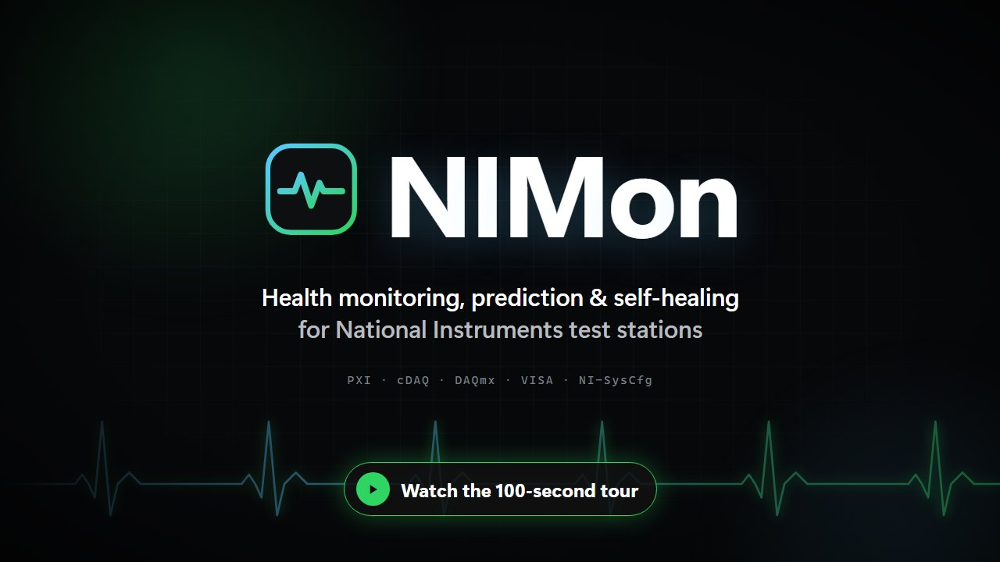
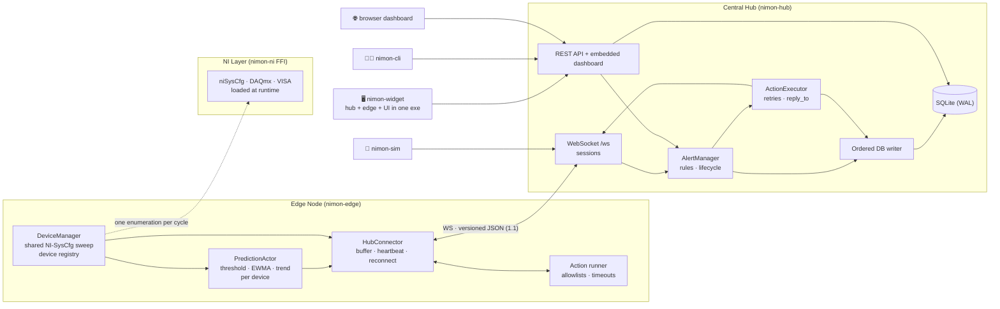

<div align="center">

# ◈ NIMon

**Real-time monitoring, prediction, and self-healing for National Instruments test stations.**

Rust · Actix · Axum · Tokio · SQLite · React + shadcn/ui · Tauri

[](https://github.com/zeshanabdullah10/nimon/releases)
[](LICENSE)
[](https://www.rust-lang.org)
[](#prerequisites)


*Edge nodes discover NI hardware via NI-SysCfg, stream telemetry to a central hub,
and a right-docked widget keeps the whole rack visible at a glance.*

<a href="https://github.com/zeshanabdullah10/nimon/releases/download/v0.3.0/nimon-promo.mp4"></a>

*100-second tour: the problem, the desktop widget, architecture, live dashboard, prediction, alerts and self-healing
([MP4, 23 MB](https://github.com/zeshanabdullah10/nimon/releases/download/v0.3.0/nimon-promo.mp4) · source in [`video/`](video)).*

</div>

---

## Why NIMon

Test stations run PXI chassis, CompactDAQ, and C-series modules that fail
silently — a module overheats, a chassis drops off the bus, a disk fills up —
until the test itself fails and costs hours. NIMon watches the hardware layer
continuously and tells you *before* it matters:

- **Native NI integration** — discovers real and NI MAX-simulated devices through
  NI-SysCfg with zero configuration: NI MAX names (`cDAQ_9205_AI`), slot numbers,
  per-sensor temperatures with critical thresholds, chassis topology, and station
  resources (RAM/disk/OS); optional NI-VISA instrument listing; NI-DAQmx device resets
- **Prediction engine** — per-device threshold, EWMA anomaly and trend models on the
  edge raise `overheating` predictions with a probability and ETA *before* the
  critical threshold trips
- **Alert lifecycle** — firing → acknowledged → resolved, cooldowns, hysteresis,
  auto-resolve, edge-offline alerts, state restored across hub restarts
- **Self-healing** — rule-driven or manual remediation (DAQmx reset, driver reset,
  service restart, allowlisted scripts) with retries and recorded results
- **Multi-channel alerting** — console, Slack, Teams, generic webhooks, and email (SMTP
  with implicit TLS / STARTTLS), with per-rule routing
- **Three interfaces, one hub** — a slim always-on-top Windows widget, a React +
  shadcn/ui web dashboard, and a CLI
- **Built for constrained machines** — one shared NI enumeration per sweep,
  `BELOW_NORMAL` priority and capped thread pools in the widget: a passive add-on
  that stays out of the way of your test software
- **Graceful degradation everywhere** — no NI drivers? Simulated fallback. Hub
  unreachable? The edge buffers. Hub already running? The widget attaches as a viewer

## Architecture



- **Protocol** — JSON envelopes with a protocol version (`1.1`; 1.0 peers still
  work). Requests the hub sends to an edge (`execute_action`) are answered with a
  `reply_to` correlation id, so action results are matched to the exact request,
  timeouts are per request, and late replies are ignored. Edges report
  `device_removed` after `api.removal_sweeps` missed sweeps.
- **Persistence** — every database write (alerts, predictions, device state,
  sampled metric history, action history) goes through one ordered writer task,
  so rows land in the order events happened; reads use the pool directly.
  SQLite runs in WAL mode with `synchronous=NORMAL` and a busy timeout.
- **Desired state** — the hub pushes poll interval and temperature thresholds to
  edges on registration and on `POST /api/v1/edges/:id/config`.

| Crate | Role |
|-------|------|
| [`nimon-core`](crates/nimon-core) | Shared types, protocol, alert rules, actor messages, DB schema + repositories |
| [`nimon-ni`](crates/nimon-ni) | Runtime-loaded FFI to NI-SysCfg (aliases, slots, sensors, system info), NI-DAQmx (reset) and NI-VISA (listing) |
| [`nimon-edge`](crates/nimon-edge) | Device discovery, health sweeps, prediction, remediation actions, hub streaming |
| [`nimon-hub`](crates/nimon-hub) | WebSocket aggregation, REST API, embedded dashboard, alerts, actions |
| [`nimon-widget`](crates/nimon-widget) | All-in-one Windows companion: hub + edge + notch widget (Tauri 2) |
| [`nimon-cli`](crates/nimon-cli) | Admin CLI: status, edges, devices + metric export, alerts, predictions, actions, settings |
| [`nimon-sim`](crates/nimon-sim) | Edge simulator with scenarios, for hardware-free testing |
| [`web/`](web) | React + shadcn/ui dashboard, built into one HTML file the hub embeds |

## Quick start

### Option A — the widget (one exe, zero setup)

Grab [`nimon-widget.zip`](https://github.com/zeshanabdullah10/nimon/releases/latest),
unzip anywhere, and double-click `nimon-widget.exe`. That single process runs the
hub, discovers your NI hardware, and docks a monitoring strip to the right edge
of your screen.

<details>
<summary>Widget details</summary>

- **The strip** — a slim dark notch: one squircle tile per chassis with a
  severity-colored progress ring (hottest module / Tmax), plus the station tile
- **Hover a tile** — the panel expands: module cards with NI MAX names
  (`Slot 1 · NI 9205 · link ok · 4s ago`), temperature fills with severity
  ramps, peak hero, station RAM/disk, Online/Fresh/Alerts meters
- **Drag** the bar anywhere; **lock** it via the padlock or the tray menu —
  position and lock state persist across restarts
- **Attach mode** — if a hub is already running on the port, the widget becomes
  a pure viewer instead of starting a second stack
- Tray icon → *Open Dashboard* / *Lock position* / *Quit*
- Flags: `--port <n>`, `--hub http://host:port --no-hub --no-edge` (remote viewer)
- The embedded hub reads `config/test-hub.yaml` and the edge `config/edge.yaml`
  next to the exe when present
- Auto-start: `Win+R` → `shell:startup` → drop a shortcut

Requires Windows 10/11 x64 with the WebView2 runtime (preinstalled on current
Windows) — [bootstrapper here](https://developer.microsoft.com/microsoft-edge/webview2/)
if needed. NI drivers optional; without them the edge reports simulated devices.

</details>

### Option B — from source

```bash
git clone https://github.com/zeshanabdullah10/nimon.git
cd nimon

# the hub embeds web/dist/index.html at compile time: build the dashboard first
npm --prefix web ci && npm --prefix web run build
cargo build --workspace --release

# hub (terminal 1)
./target/release/nimon-hub config/test-hub.yaml

# edge against real/simulated NI hardware (terminal 2, needs NI MAX)
./target/release/nimon-edge config/edge.yaml

# dashboard + API
open http://localhost:9090
```

### Option C — no NI hardware at all

```bash
cargo run -p nimon-hub -- config/test-hub.yaml       # terminal 1
cargo run -p nimon-sim -- --scenario overheat        # terminal 2
cargo run -p nimon-cli -- alerts                     # terminal 3
```

The simulator drives fake edges over the real WebSocket protocol (default: one
edge with 4 devices, a sweep every 5 s), answers `execute_action` requests, and
reports device removal — so hub, alerts, predictions, actions, dashboard and
widget attach mode can all be exercised on any machine.

| `--scenario` | Behaviour |
|--------------|-----------|
| `steady` (default) | Healthy devices: bounded random walk well below the warning threshold |
| `overheat` | One device ramps ~1 °C per interval through warning to critical and plateaus |
| `flap` | One device oscillates around the warning threshold (exercises hysteresis/cooldown) |
| `offline` | One device stops reporting, later a `device_removed` is sent |
| `reconnect` | Every edge drops and re-establishes its socket periodically |
| `duplicate` | Two devices share a product name (ids use the `#1`/`#2` suffix form) |
| `burst` | 20 edges × 16 devices on a 0.5 s interval; prints msgs/sec |

Other flags: `--url ws://host:port/ws` (env `NIMON_HUB_WS`), `--token`
(env `NIMON_EDGE_TOKEN`), `--edges N`, `--devices N`, `--interval-secs S`,
`--seed N`, `--duration-secs S` (then print a summary),
`--action-mode success|fail|timeout|delay:<ms>`, `--edge-prefix`, `-v`.
See `nimon-sim --help`.

## What you see

### Dashboard (`http://localhost:9090`)

A React + shadcn/ui single-page app, compiled into one HTML file that the hub
embeds and serves at `/` (gzip, ETag-revalidated). It uses the same REST API as
the CLI and widget:

- **Overview** — fleet health, hottest modules, active alerts, predictions, controller resources
- **Devices** — every module (live and last-known), filters for devices needing attention or not
  reporting, a detail drawer with the temperature history chart and manual actions
- **Edges** — live and offline edges, last seen, and a configuration dialog that pushes
  poll interval / thresholds
- **Alerts** — active alerts with acknowledge / resolve, and alert history
- **Predictions** — active predictions with probability and ETA
- **Settings** — hub health, thresholds, alerting settings and the API token used for writes

### Per-device telemetry

| Data | Source |
|------|--------|
| NI MAX device name (DAQmx alias) | survives user renames in NI MAX |
| Slot number, parent chassis GUID | true chassis topology |
| Named temperature sensors + critical thresholds | `temperature[TempSensor1]`, … |
| Reachability, last seen | per sweep |
| Station RAM/disk total+free, OS, hostname | attached to the host device |
| VISA instruments (optional) | resource list, `*IDN?` only when `probe_idn: true` |
| Predictions (type, probability, ETA) | edge prediction models |

## Configuration

### Hub

`nimon-hub [config.yaml]` — without a path the built-in defaults are used.
[`config/hub.example.yaml`](config/hub.example.yaml) documents **every** key with
its default; [`config/test-hub.yaml`](config/test-hub.yaml) is a minimal dev config.

```yaml
host: "0.0.0.0"
port: 9090
database_path: "data/nimon.db"
cors_allowed_origins: []        # empty = no CORS layer (dashboard is same-origin)

auth:
  api_token: null               # Bearer token for POST /api/* (reads stay open)
  edge_token: null              # token edges must present on /ws

alert:
  default_cooldown_minutes: 5
  max_firing_count: 100
  prediction_alert_threshold: 0.8
  prediction_ttl_minutes: 15
  edge_alert_ttl_minutes: 30
  edge_offline_after_secs: 90   # 0 disables the edge-offline alert
  evaluate_interval_secs: 30
  notification_channels: []     # console is always available
  rules: []                     # empty = built-in default rules

edges:
  defaults: {}                  # poll_interval_secs, temperature_warning, temperature_critical
  overrides: []                 # per edge_id
  session_timeout_secs: 120

maintenance:                    # retention (days) and sampling
  alert_retention_days: 30
  metric_retention_days: 30
  metric_sample_interval_secs: 60
```

Environment overrides: `NIMON_API_TOKEN`, `NIMON_EDGE_TOKEN`, `NIMON_SMTP_USER`,
`NIMON_SMTP_PASSWORD`, `NIMON_SMTP_PASSWORD_FILE` (file whose first line is the
password), and `RUST_LOG` (default `info`).

With `rules: []` the hub loads four built-in rules: **Device Offline** (critical,
no report for 5 min), **High Temperature** (warning, ≥ 65 °C, 2 °C hysteresis),
**Critical Temperature** (critical, ≥ 75 °C, 2 °C hysteresis) and **Device Error
State** (critical, healthy → error). Once any rule is configured the defaults are
not used.

<details>
<summary><b>Alert rules</b></summary>

```yaml
alert:
  rules:
  - name: "High Temperature"
    severity: "critical"            # info | warning | critical
    condition:
      MetricThreshold:
        metric: "temperature"
        threshold: 75.0
        comparison: "greater_than"  # gt lt eq ne ge le (also > < == != >= <=)
        hysteresis: 2.0             # optional: clears only below 73.0
        duration_minutes: 3         # optional: must breach for 3 min first
    cooldown_minutes: 5             # optional: default alert.default_cooldown_minutes
    max_firing_count: 10            # optional: default alert.max_firing_count
    notification_channels: ["slack-ops"]
    action:                         # optional self-healing action
      type: power_cycle             # script | restart_service | power_cycle | edge_command | custom_script
      delay_secs: 5
    on_failure:                     # optional fallback after the action's retries
      type: custom_script
      script: "escalate.ps1"

  - name: "Device Offline"
    severity: "warning"
    condition:
      DeviceOffline:
        max_minutes_since_poll: 10

  - name: "Hot and degrading"
    condition:
      Composite:
        op: "and"                   # and | or
        conditions:
          - MetricThreshold:
              metric: "temperature"
              threshold: 60.0
          - DeviceOffline:
              max_minutes_since_poll: 3
```

Condition types: `MetricThreshold` (flat or nested — both accepted),
`DeviceOffline`, `HealthStatusChange` (`from`/`to`: healthy, warning, error,
offline), `Prediction` (`prediction_type`, `min_probability`, `max_eta_minutes`),
`Composite`. Invalid rules are logged at startup and skipped; `run_as` on script
actions is rejected.

</details>

<details>
<summary><b>Notification channels</b></summary>

```yaml
alert:
  notification_channels:
  - channel_type: "console"
  - channel_type: "slack"
    name: "slack-ops"
    webhook_url: "https://hooks.slack.com/services/XXX/YYY/ZZZ"
  - channel_type: "teams"
    webhook_url: "https://example.webhook.office.com/webhookb2/XXX"
  - channel_type: "webhook"         # JSON POST of the alert
    webhook_url: "https://example.com/webhook"
    headers:
      - ["X-Token", "abc"]
  - channel_type: "email"
    name: "ops-mail"                # rule.notification_channels refers to this
    smtp_server: "smtp.example.com"
    smtp_port: 587
    smtp_tls: "starttls"            # implicit | starttls | opportunistic | none
    smtp_username: "nimon@example.com"  # NIMON_SMTP_USER overrides
    smtp_password_file: "smtp-password" # or NIMON_SMTP_PASSWORD(_FILE)
    from_addr: "nimon@example.com"
    to_addrs: ["ops@example.com"]
```

A console channel is added automatically when none is configured, so alerts
are never lost. A rule's `notification_channels` selects channels by `name`
(which defaults to the channel type); rules with no channels notify every
enabled channel. SMTP TLS defaults by port (465 implicit, 25 opportunistic,
otherwise STARTTLS required); credentials are never sent over an unencrypted
connection unless `smtp_allow_plaintext_auth: true`. Password precedence:
`NIMON_SMTP_PASSWORD` > file named by `NIMON_SMTP_PASSWORD_FILE` >
`smtp_password_file` > `smtp_password`.

</details>

### Edge (`config/edge.yaml`)

`nimon-edge [config.yaml]` (default `config/edge.yaml`). Every key is documented in
[`config/edge.example.yaml`](config/edge.example.yaml):

```yaml
node:
  id: "edge-01"
  name: "Local Edge 1"
  hub_address: "127.0.0.1:9090"   # host:port, or ws:// / wss:// URL ("/ws" appended)
  tls: false                      # wss:// even without a scheme
  # hub_token: "..."              # NIMON_EDGE_TOKEN overrides
  reconnect_interval_secs: 5      # exponential backoff with jitter ...
  max_reconnect_interval_secs: 60 # ... up to this
  heartbeat_interval_secs: 30
  ping_interval_secs: 30          # dead connection after 3 silent intervals

api:
  syscfg: { enabled: true, poll_interval_secs: 30 }   # one NI-SysCfg sweep per interval
  daqmx:  { enabled: true }                           # allows hub-requested resets
  visa:   { enabled: false, poll_interval_secs: 60, probe_idn: false, expression: "?*INSTR" }
  removal_sweeps: 3

prediction:
  enabled: true
  models: [threshold, ewma_anomaly, trend_prediction]
  temperature_warning: 65         # the hub may override thresholds
  temperature_critical: 75
  ewma_min_std: 0.5
  trend_reemit_minutes: 10

action:                           # hub-requested remediation
  allowed_scripts: []             # custom_script allowlist (files in scripts_dir)
  scripts_dir: "./scripts"
  allowed_services: []            # restart_services allowlist (empty = denied)
  timeout_secs: 120
  max_concurrent: 1

buffer:  { enabled: true, max_messages: 1000, max_size_mb: 16 }
logging: { level: info, file: "./logs/nimon-edge.log", stdout: true }  # RUST_LOG overrides
```

The hub pushes desired state (`poll_interval_secs`, temperature thresholds) to
edges when they register and at runtime via `POST /api/v1/edges/:id/config`
(`nimon-cli edges push-config`). Pushes are **partial**: only the fields you
send change (1.0 edges receive full thresholds resolved against the stored
state). Values live in memory on the hub: config-file `edges.defaults` /
`edges.overrides` survive restarts, API pushes do not. A push to an offline
edge is stored (202) and applied when it registers.

### Authentication and TLS

- `auth.api_token` / `NIMON_API_TOKEN`: every non-GET `/api/*` request needs
  `Authorization: Bearer <token>` (401 otherwise). The CLI sends `--token` /
  `NIMON_API_TOKEN`; the dashboard asks for the token in Settings.
- `auth.edge_token` / `NIMON_EDGE_TOKEN`: edges must present the token on `/ws`
  (`Authorization: Bearer` header, or `?token=`); the edge sends
  `node.hub_token` / `NIMON_EDGE_TOKEN`.
- The hub serves plain HTTP/WS. For TLS put it behind a reverse proxy (nginx,
  Caddy, IIS ARR) that terminates HTTPS and forwards WebSocket upgrades on
  `/ws`, then point edges at `wss://hub.example.com` (or `tls: true`) and the CLI
  at `--hub https://hub.example.com`.

## Alert lifecycle

| State | Meaning |
|-------|---------|
| `firing` | Condition holds; notifications sent, rule action executed |
| `acknowledged` | Still active, but re-notification and repeat actions stop |
| `resolved` | Condition cleared, TTL expired, or resolved by an operator |
| `pending` / `suppressed` | Part of the status model and API filters; during a `duration_minutes` window no alert row exists yet |

- One active alert per (rule, edge, device). While active it **re-fires** at most
  once per cooldown (`cooldown_minutes`, falling back to
  `alert.default_cooldown_minutes`), unless `suppress_repeat` or acknowledged;
  `max_firing_count` caps simultaneous alerts per rule.
- **Auto-resolve**: metric alerts resolve when the condition clears — with
  `hysteresis`, only once the value is that far back on the safe side, so a
  value hovering at the threshold does not flap. Edge-reported alerts resolve when
  the device reports healthy or after `edge_alert_ttl_minutes`; prediction alerts
  after `prediction_ttl_minutes` without a fresh prediction.
- A manually resolved alert does not re-open before its cooldown has passed.
- **Edge offline**: the built-in `builtin-edge-offline` alert fires when an edge
  is silent for `edge_offline_after_secs` and resolves when it is seen again.
- **Restart-safe**: active alerts, known devices and edges are restored from the
  database when the hub starts; retention cleanup follows `maintenance.*`.

## Self-healing actions

| Action | Runs on | Notes |
|--------|---------|-------|
| `power_cycle` | edge | NI-DAQmx device reset after `delay_secs` |
| `reset_driver` | edge | NI-DAQmx device reset, immediately (both need `api.daqmx.enabled` and a real device with an NI MAX alias) |
| `restart_services` | edge | Only names in `action.allowed_services` (Windows: `sc stop/start`, Linux: `systemctl restart`) |
| `custom_script` | edge | Only names in `action.allowed_scripts`, located in `action.scripts_dir` |
| `script` | hub | argv (no shell) with `${ALERT_ID}`, `${DEVICE_ID}`, `${EDGE_ID}`, `${VALUE}`, … substituted |
| `restart_service` | hub | OS service on the hub host |

Actions are triggered by a rule's `action` (with `on_failure` as fallback) or
manually via `POST /api/v1/devices/:id/actions` (`nimon-cli actions run`, the
dashboard device drawer). Rule actions retry with exponential backoff; manual
actions run once. The edge only acts on devices it manages, runs one action per
device at a time (at most `action.max_concurrent` overall), bounds every action
by `action.timeout_secs` and kills a timed-out script together with its child
processes (process tree on Windows, process group on Unix). Every attempt is
recorded in the action history (`GET /api/v1/actions`) and on the alert.

## Predictions

Each device gets its own model instances on the edge (enabled via
`prediction.models`):

- **threshold** — warning/critical band transitions (deduplicated)
- **ewma_anomaly** — EWMA z-score on *rising* temperature, with a standard-deviation
  floor (`ewma_min_std`)
- **trend_prediction** — timestamp-based linear regression with a real ETA to the
  critical threshold, re-sent at most every `trend_reemit_minutes` unless the ETA
  moves by more than 20 %

All three currently produce `overheating` predictions. Probabilities grow with the
excess over the trigger and saturate at 0.99. The hub persists every prediction,
raises an alert at `alert.prediction_alert_threshold` (critical from 0.9), and
`Prediction` rule conditions can match on type, probability and ETA.

## REST API

Default `http://<hub>:9090`. Errors are always `{"error": "<message>"}`.

| Endpoint | Method | Description |
|----------|--------|-------------|
| `/health` | GET | `status` healthy/degraded (503), version, `db_ok`, `alert_manager_ok`, `edges_connected`, `uptime_secs` |
| `/` | GET | Web dashboard (embedded single-file build) |
| `/api/v1/status` | GET | Connected edges and device counts |
| `/api/v1/settings` | GET | Default + per-edge thresholds, prediction threshold, edge-offline timeout, `auth.writes_require_token` |
| `/api/v1/edges` | GET | Live sessions + offline edges from the database |
| `/api/v1/edges/:id` | GET | Edge details (live or last-known) |
| `/api/v1/edges/:id/devices` | GET | Devices of one edge (`live` flag) |
| `/api/v1/edges/:id/config` | POST | Partial desired config → `pushed`, or 202 `stored` when offline |
| `/api/v1/devices` | GET | All devices, live and last-known (`?edge_id=`) |
| `/api/v1/devices/:id/metrics` | GET | History `?metric=temperature&since&until&limit` (max 10000) |
| `/api/v1/devices/:id/actions` | POST | Manual action `{action_type, parameters}` → 202 `{action_id}` |
| `/api/v1/actions` | GET | Action history `?device_id&edge_id&limit` |
| `/api/v1/alerts` | GET | Active alerts (pending, firing, acknowledged), severity then newest first |
| `/api/v1/alerts/history` | GET | `?severity&edge_id&device_id&status&since&until&limit` (max 1000) |
| `/api/v1/alerts/:id/acknowledge` | POST | Acknowledge (stays active; 404 unknown, 409 resolved) |
| `/api/v1/alerts/:id/resolve` | POST | Resolve |
| `/api/v1/predictions` | GET | Latest active prediction per device and type |
| `/ws` | GET | Edge WebSocket (versioned JSON, heartbeat, `execute_action` / `action_result` with `reply_to`, `config_update`, `device_removed`) |

Device ids contain `:` and `#` (`edge-1:PXIe-6368#2`): percent-encode them in paths.

## CLI

```bash
nimon-cli status                                   # health + edge/device/alert/prediction counts
nimon-cli edges list                               # live and offline edges
nimon-cli edges show <edge_id>
nimon-cli edges devices <edge_id>
nimon-cli edges push-config <edge_id> --poll-interval 10 --warning 60 --critical 80
nimon-cli devices list [--edge <edge_id>]
nimon-cli devices metrics <device_id> [--metric temperature] [--last 1h | --since <RFC3339>] [--until <RFC3339>] [--limit N] [--csv]
nimon-cli alerts list                              # ID, severity, status, device, title
nimon-cli alerts history [--severity critical] [--status resolved] [--edge E] [--device D] [--last 24h] [--limit 100]
nimon-cli alerts ack <alert_id>
nimon-cli alerts resolve <alert_id>
nimon-cli predictions list
nimon-cli actions list [--device D] [--edge E] [--limit 50]
nimon-cli actions run <device_id> power_cycle|reset_driver|restart_services|custom_script [--param k=v ...] [--yes]
nimon-cli settings
```

Global options (anywhere on the line): `--hub <url>` (env `NIMON_HUB`, default
`http://127.0.0.1:9090`), `--token <token>` (env `NIMON_API_TOKEN`, sent as
`Authorization: Bearer` on writes), `--json` (raw API JSON for scripting),
`--timeout <secs>` (default 10). Timestamps are shown in local time with a
relative age; `actions run` asks for confirmation unless `--yes` is given
(and refuses without a terminal). Hub errors are printed with the hub's message
and exit code 1, e.g. `error: not found: alert 'x' not found`.

```bash
nimon-cli devices metrics 'edge-01:PXI1Slot2' --last 24h --csv > slot2.csv
nimon-cli actions run 'edge-01:PXI1Slot2' restart_services --param services=nidevldu -y
nimon-cli --json alerts list | jq -r '.alerts[] | select(.severity=="critical") | .id'
```

## Performance profile

The widget stack is built as a passive add-on for shared test stations: one
NI-SysCfg enumeration per sweep with the DLL cached process-wide, process
priority `BELOW_NORMAL`, capped thread pools, widget polling 30 s collapsed /
5 s expanded, thin-LTO stripped release builds. On the author's 9-device PXI
station (full widget stack, hub + edge + UI) steady-state CPU was measured at
about 2.3 % of one core with an earlier release; it has not been re-measured
for 0.2 — measure on your own station before relying on it.

## Services

<details>
<summary><b>Linux (systemd)</b></summary>

```bash
sudo useradd --system --home-dir /var/lib/nimon --shell /usr/sbin/nologin nimon
sudo install -Dm755 target/release/nimon-hub  /opt/nimon/bin/nimon-hub
sudo install -Dm755 target/release/nimon-edge /opt/nimon/bin/nimon-edge
sudo install -Dm644 config/hub.example.yaml  /etc/nimon/hub.yaml
sudo install -Dm644 config/edge.example.yaml /etc/nimon/edge.yaml    # edit node.*
sudo install -Dm600 /dev/null /etc/nimon/hub.env   # NIMON_API_TOKEN=..., NIMON_EDGE_TOKEN=...
sudo cp systemd/nimon-hub.service systemd/nimon-edge.service /etc/systemd/system/
sudo systemctl daemon-reload && sudo systemctl enable --now nimon-hub nimon-edge
journalctl -u nimon-hub -f
```

[`nimon-hub.service`](systemd/nimon-hub.service) runs as `nimon` with
`ProtectSystem=strict`, `NoNewPrivileges`, `PrivateTmp`, `PrivateDevices` and a
writable `StateDirectory` `/var/lib/nimon` (the working directory, so
`data/nimon.db` lands there). Secrets come from `/etc/nimon/hub.env`; the SMTP
password can be passed with `LoadCredential=` and
`NIMON_SMTP_PASSWORD_FILE=%d/smtp-password` (commented in the unit).
[`nimon-edge.service`](systemd/nimon-edge.service) stops the edge with SIGINT
(its graceful-shutdown signal) and keeps device access for NI drivers; edge
`restart_services` actions need root or a polkit rule.

</details>

<details>
<summary><b>Windows</b></summary>

**Hub — native Windows service** (`NIMonHub`, run as Administrator):

```bat
nimon-hub.exe install     :: registers "<exe> run-service" (auto start); writes config\hub.yaml next to the exe
nimon-hub.exe start
nimon-hub.exe stop
nimon-hub.exe uninstall
```

The service reads `<exe dir>\config\hub.yaml` and resolves relative paths in it
against that directory (services start in `System32`); it reports
Running/Stopped to the SCM and shuts down gracefully on `net stop`.
[`deploy/windows/install-hub-service.ps1`](deploy/windows/install-hub-service.ps1)
wraps this: copies the exe to `%ProgramFiles%\NIMon\hub`, installs an optional
`hub.yaml`, sets `RUST_LOG` for the service, configures restart-on-failure and
restricts the config directory to SYSTEM/Administrators (keep tokens there, in
`auth.*`, not in the service environment). `-Uninstall` removes it.

**Edge** — `nimon-edge` has no service mode. Either:

- [`deploy/windows/install-edge-task.ps1`](deploy/windows/install-edge-task.ps1):
  a Scheduled Task that starts `nimon-edge.exe config\edge.yaml` at boot as SYSTEM
  from `%ProgramFiles%\NIMon\edge` and restarts it after failures (stopping the
  task terminates the process); or
- [NSSM](https://nssm.cc/) for a real service with Ctrl-C shutdown:
  `nssm install NIMonEdge C:\NIMon\edge\nimon-edge.exe C:\NIMon\edge\config\edge.yaml`
  then `nssm set NIMonEdge AppDirectory C:\NIMon\edge` and `nssm start NIMonEdge`.

</details>

## Security notes

- Auth is **off by default**: set `auth.api_token` before exposing the hub beyond
  localhost — without it anyone who can reach port 9090 can acknowledge alerts,
  push edge config and trigger device resets. Reads (`GET`) are always open.
- Set `auth.edge_token` so only your edges can register and stream data.
- The hub has no built-in TLS; use a TLS-terminating reverse proxy and `wss://`
  across untrusted networks. CORS is off unless `cors_allowed_origins` is set.
- Remediation is deny-by-default on the edge: scripts and services must be
  allowlisted, device actions only target devices the edge manages, and every
  action is time-bounded. Hub-side `script` actions run as the hub's user
  (no shell, `run_as` rejected).
- Keep secrets out of world-readable files: env files / credentials (systemd),
  an ACL-restricted `config\` (Windows), `smtp_password_file` instead of
  `smtp_password`. VISA `probe_idn` writes to instruments — leave it off where
  test software owns them.

## Prerequisites

| Component | Requirement | Notes |
|-----------|-------------|-------|
| Rust | 1.75+, edition 2021 | build only |
| Node.js | 18+ with npm | build only: dashboard (`web/`) embedded into the hub |
| OS | Windows 10/11 x64 (widget), any for hub/edge | |
| NI drivers | Optional | NI System Configuration / NI-DAQmx / NI-VISA for real hardware; simulated fallback otherwise |
| WebView2 | Widget only | preinstalled on current Windows |

## Development

```bash
npm --prefix web ci && npm --prefix web run build   # before building nimon-hub
cargo test --workspace        # unit + integration
cargo fmt --workspace
cargo clippy --workspace --all-targets
npm --prefix web run dev      # dashboard dev server against a running hub
```

## Project layout

```
crates/
├── nimon-core/     shared types, protocol, alert rules, DB schema + repositories
├── nimon-ni/       NI-SysCfg / DAQmx / VISA FFI (runtime-loaded)
├── nimon-edge/     edge node library + binary
├── nimon-hub/      hub library + binary (REST, WebSocket, alerts, actions, Windows service)
├── nimon-widget/   Tauri 2 all-in-one widget
├── nimon-cli/      admin CLI
└── nimon-sim/      edge simulator
web/                React + shadcn/ui dashboard (web/dist/index.html is embedded by the hub)
config/             example + working YAML (hub.example.yaml, edge.example.yaml)
systemd/            hub + edge unit files
deploy/windows/     hub service / edge scheduled-task install scripts
dist/               packaged widget (gitignored)
```

## License

[MIT](LICENSE)
